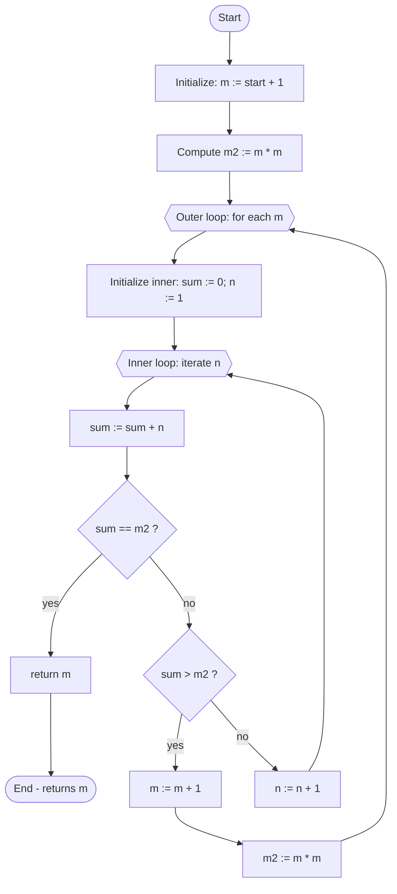

## bemerkenswert — Flowchart and explanation

This file documents the `bemerkenswert` function from `bemerkenswert.go`.

### Mermaid flowchart

### Short explanation

- Purpose: Find the smallest natural number `m > start` such that `m*m` equals a triangular number (i.e., equals `1+2+...+n` for some `n`).
- Algorithm summary:
  - Set `m := start + 1` and `m2 := m*m`.
  - For each `m`:
    - Reset `sum := 0` and `n := 1`.
    - Repeatedly add `n` to `sum` (incrementing `n` each step) until `sum == m2` (success) or `sum > m2` (failure for this `m`).
    - If success, return `m`; otherwise increment `m` and try again.

### Edge cases and notes

- Input validity: negative `start` values are not explicitly handled; the function will start from `start+1` which may be non-positive. Consider returning an error or forcing `start >= 0` depending on requirements.
- Performance: the method uses nested loops and can be slow for large `start`. A faster check uses the triangular number formula `T_n = n*(n+1)/2` and tests whether `n*(n+1)/2 == m^2` for integer `n` by solving the quadratic or testing if `8*m^2 + 1` is a perfect square (since 8*T_n + 1 = (2n+1)^2).
- Termination: the function loops until it finds a match; in practice this will find known solutions but may run long for high `start` values.

### How to view the diagram

- Use a Markdown viewer that supports Mermaid (e.g., VS Code with the "Markdown Preview Mermaid Support" extension, GitHub won't render Mermaid in regular READMEs). Alternatively, paste the Mermaid block into https://mermaid.live to render and export SVG/PNG.

---

File created to document `bemerkenswert` logic and to help future refactors.
